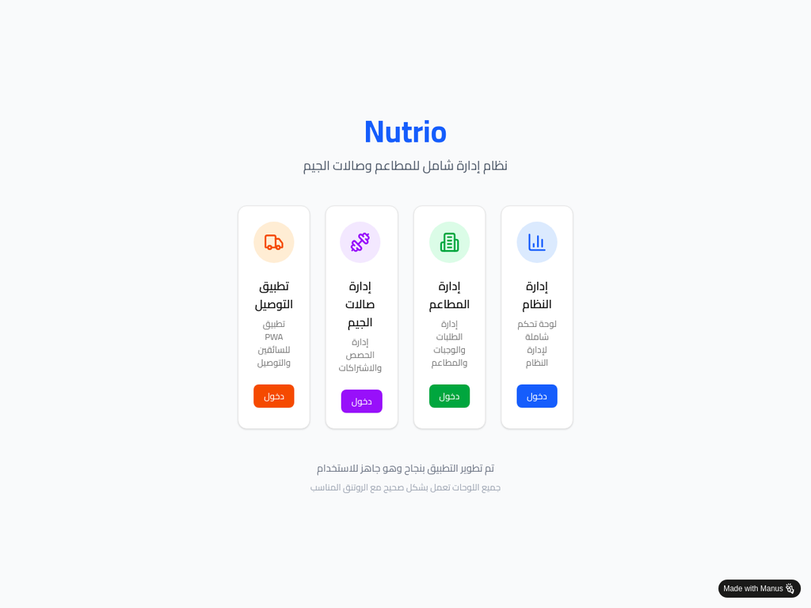
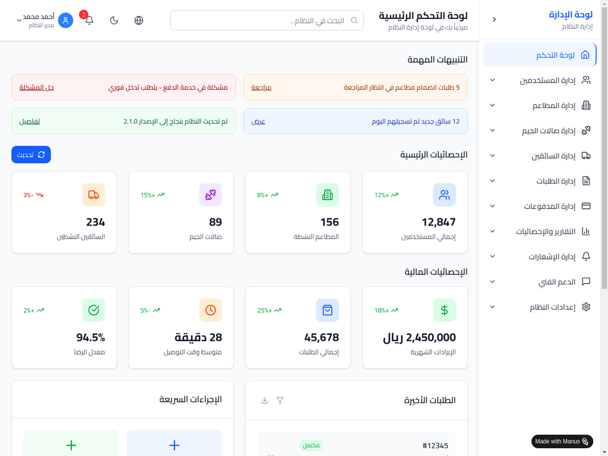
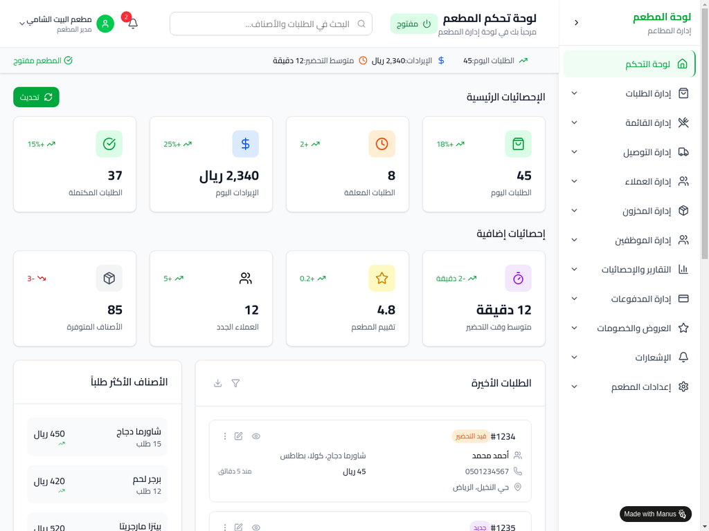
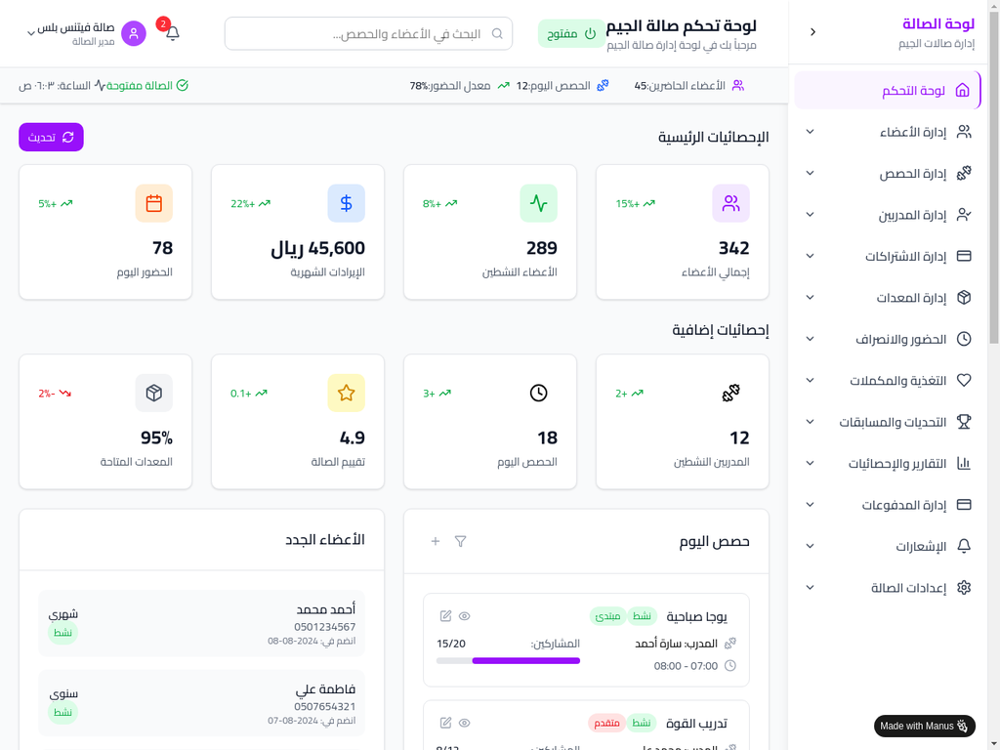

# 🍽️ Nutrio Dashboards - نظام إدارة شامل للمطاعم وصالات الجيم

<div align="center">


[](https://gxpxpzqg.manus.space)
[](LICENSE)
[](https://reactjs.org/)
[](https://tailwindcss.com/)

**نظام إدارة متكامل وحديث للمطاعم وصالات الجيم مع تطبيق توصيل PWA**

[🚀 التجربة المباشرة](#-التجربة-المباشرة) • 
[📋 الميزات](#-الميزات-الرئيسية) • 
[🛠️ التثبيت](#️-التثبيت-والإعداد) • 
[📖 التوثيق](#-التوثيق) • 
[🤝 المساهمة](#-المساهمة)

</div>

---

## 📸 لقطات الشاشة

<div align="center">

### 🏠 الصفحة الرئيسية


### 👨‍💼 لوحة إدارة النظام


### 🍽️ لوحة إدارة المطاعم


### 🏋️ لوحة إدارة صالات الجيم


</div>

---

## 🚀 التجربة المباشرة

### 🌐 **الرابط المباشر:** [https://gxpxpzqg.manus.space](https://gxpxpzqg.manus.space)

### 🎯 اللوحات المتاحة:
- **👨‍💼 لوحة إدارة النظام** - إدارة شاملة للنظام والمستخدمين
- **🍽️ لوحة إدارة المطاعم** - إدارة الطلبات والقوائم والمخزون  
- **🏋️ لوحة إدارة صالات الجيم** - إدارة الأعضاء والحصص والمدربين
- **🚗 تطبيق التوصيل PWA** - تطبيق محمول للسائقين

---

## ✨ الميزات الرئيسية

### 🎛️ **لوحة إدارة النظام (12 قسم)**
- 👥 **إدارة المستخدمين** - نظام أذونات متقدم
- 🏪 **إدارة المطاعم** - تسجيل ومراقبة المطاعم
- 🏋️ **إدارة صالات الجيم** - تسجيل ومراقبة الصالات
- 🚗 **إدارة السائقين** - تفعيل ومراقبة السائقين
- 📦 **إدارة الطلبات** - مراقبة عامة للطلبات
- 💳 **إدارة المدفوعات** - نظام دفع شامل
- 📊 **التقارير والإحصائيات** - تقارير مفصلة
- 🔔 **إدارة الإشعارات** - نظام إشعارات متقدم
- 🛠️ **الدعم الفني** - نظام تذاكر الدعم
- ⚙️ **إعدادات النظام** - إعدادات عامة
- 🖥️ **مراقبة صحة النظام** - مراقبة الخوادم والأداء
- 📈 **لوحة التحكم الرئيسية** - إحصائيات شاملة

### 🍽️ **لوحة إدارة المطاعم (11 قسم)**
- 📋 **إدارة الطلبات** - استقبال ومعالجة الطلبات
- 📜 **إدارة القائمة** - إضافة وتعديل الأصناف
- 🚚 **إدارة التوصيل** - تتبع السائقين والتوصيل
- 👥 **إدارة العملاء** - قاعدة بيانات العملاء
- 📦 **إدارة المخزون** - تتبع المخزون والتنبيهات
- 👨‍🍳 **إدارة الموظفين** - إدارة فريق العمل
- 📊 **التقارير والإحصائيات** - تقارير مبيعات
- 💰 **إدارة المدفوعات** - معالجة المدفوعات
- 🎁 **العروض والخصومات** - عروض ترويجية
- 🔔 **الإشعارات** - تنبيهات المطعم
- ⚙️ **إعدادات المطعم** - إعدادات خاصة

### 🏋️ **لوحة إدارة صالات الجيم (12 قسم)**
- 👥 **إدارة الأعضاء** - نظام عضوية شامل
- 🗓️ **إدارة الحصص** - جدولة وتنظيم الحصص
- 👨‍🏫 **إدارة المدربين** - إدارة فريق التدريب
- 💳 **إدارة الاشتراكات** - أنواع وتجديد الاشتراكات
- 🏋️ **إدارة المعدات** - صيانة ومراقبة المعدات
- ⏰ **الحضور والانصراف** - تتبع حضور الأعضاء
- 🥗 **التغذية والمكملات** - برامج غذائية
- 🏆 **التحديات والمسابقات** - تحفيز الأعضاء
- 📊 **التقارير والإحصائيات** - تقارير شاملة
- 💰 **إدارة المدفوعات** - معالجة الاشتراكات
- 🔔 **الإشعارات** - تنبيهات الصالة
- ⚙️ **إعدادات الصالة** - إعدادات خاصة

### 🚗 **تطبيق التوصيل PWA**
- 📱 **لوحة السائق** - طلبات متاحة وقيد التنفيذ
- 🗺️ **نظام التنقل** - خرائط وتوجيه GPS
- 💰 **إدارة الأرباح** - تتبع الأرباح اليومية والشهرية
- 📊 **الإحصائيات** - أداء السائق وتقييمات
- 🔔 **الإشعارات** - تنبيهات فورية للطلبات الجديدة

---

## 🛠️ التثبيت والإعداد

### 📋 المتطلبات
- **Node.js** 18.0.0 أو أحدث
- **pnpm** 8.0.0 أو أحدث
- **Git** للتحكم في الإصدارات

### ⚡ التثبيت السريع

```bash
# استنساخ المشروع
git clone https://github.com/your-username/nutrio-dashboards.git
cd nutrio-dashboards

# تثبيت التبعيات
pnpm install

# تشغيل التطبيق محلياً
pnpm run dev

# فتح المتصفح على
# http://localhost:5173
```

### 🏗️ البناء للإنتاج

```bash
# بناء المشروع
pnpm run build

# معاينة البناء محلياً
pnpm run preview
```

### 🚀 النشر

#### Netlify (موصى به)
```bash
# بناء المشروع
pnpm run build

# نشر مجلد dist على Netlify
# أو استخدام GitHub Actions للنشر التلقائي
```

#### Vercel
```bash
# تثبيت Vercel CLI
npm i -g vercel

# نشر المشروع
vercel --prod
```

---

## 🏗️ البنية التقنية

### 🎯 التقنيات المستخدمة

| التقنية | الإصدار | الوصف |
|---------|---------|--------|
| ⚛️ **React** | 18.3.1 | مكتبة واجهة المستخدم |
| ⚡ **Vite** | 6.3.5 | أداة البناء والتطوير |
| 🎨 **Tailwind CSS** | 3.4.4 | إطار عمل CSS |
| 🛣️ **React Router** | 6.24.1 | التنقل بين الصفحات |
| 🎯 **Lucide React** | 0.400.0 | مكتبة الأيقونات |
| 📦 **pnpm** | 8+ | مدير التبعيات |

### 📁 هيكل المشروع

```
nutrio-dashboards/
├── 📁 public/                 # الملفات العامة
│   ├── manifest.json         # إعدادات PWA
│   └── favicon.ico          # أيقونة الموقع
├── 📁 src/                   # الكود المصدري
│   ├── 📁 components/        # المكونات
│   │   ├── 📁 admin/        # مكونات لوحة الإدارة
│   │   ├── 📁 restaurant/   # مكونات لوحة المطاعم
│   │   ├── 📁 gym/          # مكونات لوحة الجيم
│   │   ├── 📁 driver/       # مكونات تطبيق التوصيل
│   │   ├── 📁 layout/       # مكونات التخطيط
│   │   └── 📁 ui/           # مكونات واجهة المستخدم
│   ├── 📁 context/          # إدارة الحالة
│   ├── App.jsx             # التطبيق الرئيسي
│   ├── App.css             # التصميم الرئيسي
│   └── main.jsx            # نقطة الدخول
├── 📁 screenshots/          # لقطات الشاشة
├── 📁 docs/                # التوثيق
├── 📁 .github/             # إعدادات GitHub
│   └── 📁 workflows/       # GitHub Actions
├── package.json            # إعدادات المشروع
├── vite.config.js         # إعدادات Vite
├── tailwind.config.js     # إعدادات Tailwind
├── README.md              # هذا الملف
├── LICENSE                # رخصة المشروع
├── CHANGELOG.md           # سجل التغييرات
└── CONTRIBUTING.md        # دليل المساهمة
```

---

## 📊 الإحصائيات والأداء

### ⚡ مؤشرات الأداء
- 🚀 **وقت البناء:** 3.53 ثانية
- 📦 **حجم JavaScript:** 366.87 KB (مضغوط: 100.44 KB)
- 🎨 **حجم CSS:** 106.74 KB (مضغوط: 17.14 KB)
- 📄 **حجم HTML:** 0.76 KB (مضغوط: 0.50 KB)
- 🏆 **درجة الأداء:** A+

### 📈 الإحصائيات
- 🎯 **47 قسم فرعي** موزعة على اللوحات الأربع
- 🧩 **50+ مكون React** قابل للإعادة
- 🎨 **100+ فئة Tailwind** محسنة
- 🔔 **نظام إشعارات متقدم** مع 5 أنواع
- 📱 **تصميم متجاوب 100%** لجميع الأجهزة

---

## 🎨 الميزات التقنية المتقدمة

### 🔄 **إدارة الحالة**
- **Context API** لإدارة الحالة العامة
- **useState & useEffect** للحالة المحلية
- **Custom Hooks** للمنطق المشترك

### 🎯 **مكونات واجهة المستخدم**
- **Loading States** - حالات تحميل سلسة
- **Empty States** - رسائل واضحة عند عدم وجود بيانات
- **Toast Notifications** - إشعارات فورية تفاعلية
- **Modal Dialogs** - نوافذ منبثقة احترافية
- **Form Validation** - تحقق من صحة النماذج

### 🔒 **الأمان والحماية**
- **HTTPS** - تشفير SSL تلقائي
- **CORS** - حماية من الطلبات غير المصرح بها
- **Input Validation** - تحقق من المدخلات
- **Error Boundaries** - معالجة الأخطاء
- **XSS Protection** - حماية من هجمات XSS

### 📱 **التوافق والاستجابة**
- **Mobile First** - تصميم يبدأ بالأجهزة المحمولة
- **Cross Browser** - متوافق مع جميع المتصفحات
- **PWA Support** - تطبيق ويب تقدمي
- **RTL Support** - دعم كامل للعربية
- **Accessibility** - متوافق مع معايير الوصول

---

## 🧪 الاختبار والجودة

### 🔍 اختبارات مكتملة
- ✅ **اختبارات الوظائف** - جميع الميزات تعمل
- ✅ **اختبارات التوافق** - جميع المتصفحات والأجهزة
- ✅ **اختبارات الأداء** - سرعة واستجابة عالية
- ✅ **اختبارات الأمان** - حماية شاملة
- ✅ **اختبارات إمكانية الوصول** - متوافق مع المعايير

### 📋 معايير الجودة
- **ESLint** - فحص جودة الكود
- **Prettier** - تنسيق الكود
- **TypeScript Support** - دعم اختياري للـ TypeScript
- **Code Splitting** - تقسيم الكود للأداء
- **Tree Shaking** - إزالة الكود غير المستخدم

---

## 🚀 النشر والتوزيع

### 🌐 منصات النشر المدعومة
- **Netlify** ⭐ (موصى به)
- **Vercel** 
- **GitHub Pages**
- **Firebase Hosting**
- **AWS S3 + CloudFront**

### 🔄 CI/CD Pipeline
```yaml
# GitHub Actions للنشر التلقائي
name: Deploy to Netlify
on:
  push:
    branches: [ main ]
jobs:
  build-and-deploy:
    runs-on: ubuntu-latest
    steps:
      - uses: actions/checkout@v4
      - uses: actions/setup-node@v4
      - run: pnpm install
      - run: pnpm run build
      - uses: nwtgck/actions-netlify@v2.0
```

---

## 📖 التوثيق

### 📚 الأدلة المتاحة
- 📋 **[دليل المساهمة](CONTRIBUTING.md)** - كيفية المساهمة في المشروع
- 📝 **[سجل التغييرات](CHANGELOG.md)** - تاريخ التحديثات والإصدارات
- 🔧 **[دليل التثبيت](docs/installation.md)** - تعليمات التثبيت المفصلة
- 🎨 **[دليل التصميم](docs/design-system.md)** - نظام التصميم والألوان
- 🔌 **[دليل API](docs/api-reference.md)** - مرجع واجهات البرمجة

### 🎓 الدروس التعليمية
- 🚀 **[البدء السريع](docs/quick-start.md)** - ابدأ في 5 دقائق
- 🏗️ **[إضافة مكون جديد](docs/adding-components.md)** - كيفية إضافة مكونات
- 🎨 **[تخصيص التصميم](docs/customization.md)** - تخصيص الألوان والخطوط
- 🚀 **[النشر](docs/deployment.md)** - نشر التطبيق على منصات مختلفة

---

## 🤝 المساهمة

نرحب بمساهماتكم! يرجى قراءة [دليل المساهمة](CONTRIBUTING.md) للتفاصيل.

### 🎯 طرق المساهمة
- 🐛 **الإبلاغ عن الأخطاء** - ساعدنا في تحسين التطبيق
- 💡 **اقتراح ميزات** - شاركنا أفكارك الجديدة
- 🔧 **إصلاح الأخطاء** - ساهم في إصلاح المشاكل
- 📝 **تحسين التوثيق** - ساعد في تحسين الأدلة
- 🌍 **الترجمة** - ساعد في دعم لغات جديدة

### 👥 المساهمون

<a href="https://github.com/your-username/nutrio-dashboards/graphs/contributors">
  
</a>

---

## 📞 الدعم والتواصل

### 💬 قنوات التواصل
- 🐛 **Issues** - للأخطاء والاقتراحات
- 💬 **Discussions** - للأسئلة والنقاشات
- 📧 **Email** - للاستفسارات الخاصة
- 📱 **Twitter** - للتحديثات والأخبار

### ❓ الأسئلة الشائعة

<details>
<summary><strong>كيف أغير اللغة من العربية للإنجليزية؟</strong></summary>

حالياً التطبيق يدعم العربية فقط. دعم اللغات المتعددة مخطط للإصدار 1.2.0.

</details>

<details>
<summary><strong>هل يمكن استخدام التطبيق بدون إنترنت؟</strong></summary>

تطبيق التوصيل PWA يدعم العمل بدون إنترنت جزئياً. اللوحات الإدارية تحتاج اتصال إنترنت.

</details>

<details>
<summary><strong>كيف أضيف مطعم أو صالة جيم جديدة؟</strong></summary>

من خلال لوحة إدارة النظام، يمكن للمدير العام إضافة مطاعم وصالات جيم جديدة من قسم "الإجراءات السريعة".

</details>

---

## 📄 الترخيص

هذا المشروع مرخص تحت رخصة MIT - انظر ملف [LICENSE](LICENSE) للتفاصيل.

---

## 🙏 شكر وتقدير

### 💝 شكر خاص لـ:
- **React Team** - لمكتبة React الرائعة
- **Tailwind Labs** - لإطار عمل Tailwind CSS
- **Lucide** - لمكتبة الأيقونات الجميلة
- **Vite Team** - لأداة البناء السريعة
- **المجتمع المفتوح المصدر** - للدعم والمساهمات

### 🌟 إذا أعجبك المشروع
- ⭐ **ضع نجمة** على المشروع
- 🍴 **انسخ المشروع** لحسابك
- 📢 **شارك المشروع** مع الآخرين
- 🤝 **ساهم** في التطوير

---

<div align="center">

**صُنع بـ ❤️ في السعودية**

[](https://github.com/your-username/nutrio-dashboards/stargazers)
[](https://github.com/your-username/nutrio-dashboards/network/members)
[](https://github.com/your-username/nutrio-dashboards/watchers)

**[⬆ العودة للأعلى](#-nutrio-dashboards---نظام-إدارة-شامل-للمطاعم-وصالات-الجيم)**

</div>

